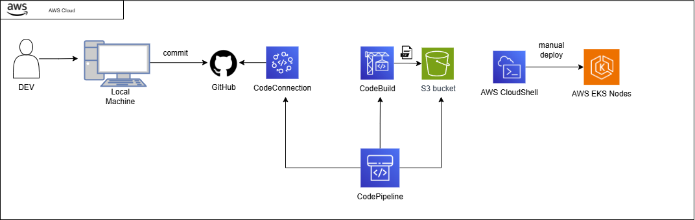

  # AWS CI/CD Pipeline Setup Guide

  Complete guide for setting up CI/CD pipeline for Task Manager API using AWS CodePipeline and CodeBuild.

  ## Prerequisites

  - AWS Account with appropriate permissions
  - GitHub repository with your code
  - EKS cluster created and running
  - ECR repository created

  ## Repository Structure Required

  ```
  task-manager-backend-task1/
  ├── src/                    # Java source code
  ├── pom.xml                 # Maven configuration
  ├── Dockerfile              # MUST be named exactly "Dockerfile" (not DockerFile)
  ├── buildspec.yml           # CodeBuild instructions
  ├── app.yml                 # Kubernetes app deployment
  ├── mongodb.yml             # Kubernetes MongoDB deployment
  └── docker-compose.yml      # Local testing (optional)


  ```

## ARCHITECTURE


  ## Step 1: Prepare Your GitHub Repository

  ### 1.1 Ensure Dockerfile exists (case-sensitive)
  ```bash
  # In your local repo or CloudShell
  cd task-manager-backend-task1

  # Check current files
  ls -la

  # If you have "DockerFile", rename it to "Dockerfile"
  mv DockerFile Dockerfile

  # Commit the change
  git add Dockerfile
  git commit -m "Fix Dockerfile name"
  git push origin main
  ```

  ### 1.2 Update app.yml with correct ECR URL
  ```yaml
  # In app.yml, update the image URL:
  image: 975050195505.dkr.ecr.us-east-1.amazonaws.com/task-manager-api:latest
  ```

  ```bash
  git add app.yml
  git commit -m "Update ECR URL"
  git push origin main
  ```

  ### 1.3 Verify buildspec.yml has correct variables
  ```yaml
  env:
    variables:
      AWS_ACCOUNT_ID: "ACCOUNT_ID"
      AWS_DEFAULT_REGION: "ACCOUNT_REGION"
  ```

  ## Step 2: Create CodePipeline

  ### 2.1 Navigate to CodePipeline Console
  - Go to AWS Console → CodePipeline
  - Click "Create pipeline"

  ### 2.2 Pipeline Settings
  ```
  Pipeline name: task-manager-pipeline
  Service role: New service role (let AWS create it)
  Role name: (auto-generated)
  ```
  Click **Next**

  ### 2.3 Source Stage Configuration

  **Provider:** GitHub (Version 2)

  **Connection Setup:**
  1. Click "Connect to GitHub"
  2. Connection name: `github-connection`
  3. Click "Install a new app"
  4. Authorize AWS Connector for GitHub
  5. Select your repository: `V-VigneshR/task-manager-backend-task1`

  **Repository Configuration:**
  ```
  Repository name: V-VigneshR/task-manager-backend-task1
  Branch name: main
  Output artifact format: CodePipeline default
  ```

  **Change detection:** Use Amazon CloudWatch Events (default)

  Click **Next**

  ### 2.4 Build Stage Configuration

  **Build provider:** AWS CodeBuild

  Click "Create project" to create a new CodeBuild project

  ## Step 3: Configure CodeBuild Project

  ### 3.1 Project Configuration
  ```
  Project name: task-manager-build
  Description: Builds Task Manager API Docker image
  ```

  ### 3.2 Environment Configuration

  **Environment image:** Managed image

  **Operating system:** Ubuntu

  **Runtime(s):** Standard

  **Image:** aws/codebuild/standard:7.0

  **Image version:** Always use the latest image

  **Environment type:** Linux

  **Privileged:** ✅ **MUST BE CHECKED** (Required for Docker builds)

  **Service role:** New service role
  ```
  Role name: codebuild-task-manager-build-service-role (auto-generated)
  ```

  ### 3.3 Buildspec Configuration
  ```
  Build specifications: Use a buildspec file
  Buildspec name: buildspec.yml
  ```

  ### 3.4 Environment Variables
  Add these environment variables:

  | Name | Value | Type |
  |------|-------|------|
  | AWS_ACCOUNT_ID | ACCOUNT_ID | Plaintext |
  | AWS_DEFAULT_REGION | ACCOUNT_REGION | Plaintext |

  ### 3.5 Logs Configuration
  ```
  CloudWatch logs: Enabled
  Group name: /aws/codebuild/task-manager-build (auto)
  Stream name: (auto)
  ```

  Click "Continue to CodePipeline"

  Click **Next**

  ### 3.6 Deploy Stage
  ```
  Skip deploy stage (we'll deploy manually to EKS)
  ```
  Click "Skip"

  Click **Create pipeline**

  ## Step 4: Fix IAM Permissions

  The CodeBuild service role needs ECR permissions to push images.

  ### 4.1 Via AWS Console
  1. Go to IAM → Roles
  2. Search for `codebuild-task-manager-build-service-role`
  3. Click on the role
  4. Click "Add permissions" → "Attach policies"
  5. Search for and select: `AmazonEC2ContainerRegistryPowerUser`
  6. Click "Attach policies"

  ### 4.2 Via AWS CLI
  ```bash
  aws iam attach-role-policy \
    --role-name codebuild-task-manager-build-service-role \
    --policy-arn arn:aws:iam::aws:policy/AmazonEC2ContainerRegistryPowerUser
  ```

  ## Step 5: Test the Pipeline

  ### 5.1 Trigger Pipeline
  - Go to CodePipeline console
  - Select your pipeline: `task-manager-pipeline`
  - Click "Release change"

  ### 5.2 Monitor Execution
  Watch the pipeline stages:
  1. **Source** - Pulls code from GitHub (should take ~10 seconds)
  2. **Build** - Builds Docker image and pushes to ECR (takes 3-5 minutes)

  ### 5.3 Check Build Logs
  If build fails:
  1. Click on "Details" in the Build stage
  2. View the build logs
  3. Common issues:
    - Dockerfile not found (wrong name or not committed)
    - Docker permission denied (Privileged mode not enabled)
    - ECR push failed (IAM permissions missing)

  ## Step 6: Verify Image in ECR

  ```bash
  # List images in your ECR repository
  aws ecr list-images \
    --repository-name task-manager-api \
    --region us-east-1

  # Expected output shows "latest" and a commit hash tag
  ```

  ## Step 7: Deploy to EKS

  Once the pipeline succeeds and image is in ECR:

  ### 7.1 Configure kubectl
  ```bash
  aws eks update-kubeconfig \
    --region us-east-1 \
    --name YOUR_CLUSTER_NAME
  ```

  ### 7.2 Deploy MongoDB
  ```bash
  kubectl apply -f mongodb.yml

  # Wait for MongoDB to be ready
  kubectl get pods -w
  ```

  **Important Note on Storage:** 
  The MongoDB deployment uses `hostPath` storage instead of persistent volume claims (PVC) with EBS. This decision was made due to time constraints as the EKS cluster required additional configuration of the EBS CSI driver for dynamic volume provisioning. The PVC remained in `Pending` state during initial deployment attempts.

  **Storage Configuration:**
  - **Type:** hostPath (node-local storage)
  - **Path:** `/data/mongodb` on the worker node
  - **Persistence:** Data persists through pod restarts but not node failures
  - **Limitation:** Not suitable for production multi-node scenarios

  **For Production:** Consider installing the Amazon EBS CSI driver and using PersistentVolumeClaims with `gp2` or `gp3` storage class for true persistent, multi-AZ storage.

  ```bash
  # To check storage status:
  kubectl describe pod -l app=mongodb | grep -A5 Volumes
  ```

  ### 7.3 Deploy Application
  ```bash
  kubectl apply -f app.yml

  # Wait for pods to be ready
  kubectl get pods -w
  ```

  ### 7.4 Get LoadBalancer URL
  ```bash
  kubectl get svc task-manager-service

  # Wait for EXTERNAL-IP (takes 2-3 minutes)
  export LB_URL=$(kubectl get svc task-manager-service -o jsonpath='{.status.loadBalancer.ingress[0].hostname}')
  echo "API URL: http://$LB_URL/api/v1"
  ```

  ## Step 8: Test Deployment

  ```bash
  # Health check
  curl http://$LB_URL/api/v1/tasks/health

  # Create a task
  curl -X PUT http://$LB_URL/api/v1/tasks \
    -H "Content-Type: application/json" \
    -d '{
      "id": "test-1",
      "name": "CI/CD Test",
      "owner": "Pipeline",
      "command": "echo Hello from EKS!"
    }'

  # Get all tasks
  curl http://$LB_URL/api/v1/tasks
  ```

  ## CI/CD Pipeline Flow

  ```
  ┌─────────────────┐
  │  Developer      │
  │  Pushes Code    │
  └────────┬────────┘
          │
          ▼
  ┌─────────────────┐
  │  GitHub         │
  │  Repository     │
  └────────┬────────┘
          │
          ▼
  ┌─────────────────┐
  │  CodePipeline   │
  │  Detects Change │
  └────────┬────────┘
          │
          ▼
  ┌─────────────────┐
  │  CodeBuild      │
  │  - Pull code    │
  │  - Build image  │
  │  - Push to ECR  │
  └────────┬────────┘
          │
          ▼
  ┌─────────────────┐
  │  Amazon ECR     │
  │  Stores Image   │
  └────────┬────────┘
          │
          ▼
  ┌─────────────────┐
  │  Manual Deploy  │
  │  kubectl apply  │
  └────────┬────────┘
          │
          ▼
  ┌─────────────────┐
  │  EKS Cluster    │
  │  Runs Pods      │
  └─────────────────┘
  ```

  ## Troubleshooting

  ### Build Fails: "Dockerfile not found"
  ```bash
  # Check your GitHub repo
  git ls-files | grep -i docker

  # Ensure it's named exactly "Dockerfile"
  # Rename if needed
  mv DockerFile Dockerfile
  git add Dockerfile
  git commit -m "Fix Dockerfile name"
  git push
  ```

  ### Build Fails: "Cannot connect to Docker daemon"
  - Ensure "Privileged" mode is enabled in CodeBuild environment settings
  - Go to CodeBuild → Projects → task-manager-build → Edit → Environment
  - Check "Privileged" checkbox

  ### Build Fails: "Access Denied to ECR"
  ```bash
  # Attach ECR policy to CodeBuild role
  aws iam attach-role-policy \
    --role-name codebuild-task-manager-build-service-role \
    --policy-arn arn:aws:iam::aws:policy/AmazonEC2ContainerRegistryPowerUser
  ```

  ### Pipeline Doesn't Trigger on Push
  - Check CloudWatch Events rule is created
  - Go to EventBridge → Rules
  - Look for rule named like: `codepipeline-task-manager-pipeline-*`
  - Ensure it's enabled

  ### Pods Stuck in ImagePullBackOff
  ```bash
  # Check if image exists in ECR
  aws ecr describe-images \
    --repository-name task-manager-api \
    --region us-east-1

  # Check if app.yml has correct image URL
  kubectl describe pod -l app=task-manager
  ```

  ## Making Changes

  After pipeline is set up, your workflow is:

  ```bash
  # 1. Make code changes locally
  # Edit Java files

  # 2. Commit and push
  git add .
  git commit -m "Your changes"
  git push origin main

  # 3. Pipeline automatically triggers
  # Monitor in CodePipeline console

  # 4. After build succeeds, update EKS
  kubectl rollout restart deployment task-manager

  # 5. Verify
  kubectl get pods
  curl http://$LB_URL/api/v1/tasks/health
  ```

  ## Clean Up

  To delete all resources:

  ```bash
  # Delete EKS deployments
  kubectl delete -f app.yml
  kubectl delete -f mongodb.yml

  # Delete CodePipeline
  aws codepipeline delete-pipeline --name task-manager-pipeline

  # Delete CodeBuild project
  aws codebuild delete-project --name task-manager-build

  # Delete ECR images
  aws ecr batch-delete-image \
    --repository-name task-manager-api \
    --image-ids imageTag=latest

  # Delete ECR repository
  aws ecr delete-repository \
    --repository-name task-manager-api \
    --force
  ```

  ---

  ## Summary Checklist

  - [ ] GitHub repo has correct files (Dockerfile, buildspec.yml, app.yml, mongodb.yml)
  - [ ] Dockerfile is named exactly "Dockerfile" (case-sensitive)
  - [ ] app.yml has correct ECR image URL
  - [ ] CodePipeline created with GitHub source
  - [ ] CodeBuild project created with Privileged mode enabled
  - [ ] Environment variables set in CodeBuild
  - [ ] ECR permissions attached to CodeBuild role
  - [ ] Pipeline triggered and succeeded
  - [ ] Image visible in ECR
  - [ ] EKS cluster configured with kubectl
  - [ ] MongoDB deployed to EKS
  - [ ] Application deployed to EKS
  - [ ] LoadBalancer URL accessible
  - [ ] API endpoints responding correctly

  FINALLY !